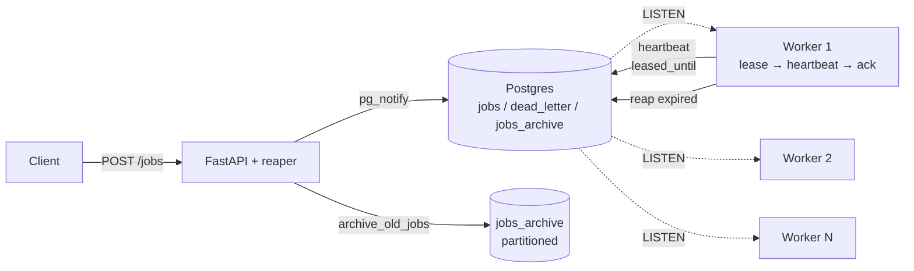
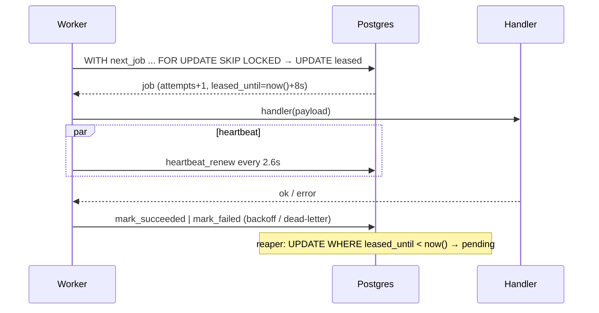
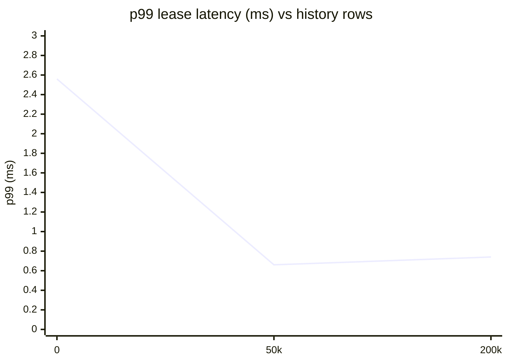

<div align="center">

# ⚡ Durable Job Queue

### *Postgres-powered background jobs — correct under concurrency, crashes & retries*

[](https://github.com/awakedupex/durable-job-queue/actions)
[](https://python.org)
[](https://postgresql.org)
[](https://fastapi.tiangolo.com)
[](LICENSE)
[](tests/)

**10k+ jobs • 500 concurrent • 0 loss • 7s reclaim • <1ms p99**

[Quick Start](#-quick-start) • [Architecture](#-architecture) • [API](#-api) • [Benchmarks](#-benchmarks) • [Chaos Tests](#-chaos--reliability)

</div>

---

## ✨ Why this exists

Most queues need Redis / RabbitMQ / Kafka. This one needs **only Postgres** — one moving part, transactional guarantees between *job state* and *business data*, and `SELECT … FOR UPDATE SKIP LOCKED` for thousands of jobs/sec without a broker.

> **At-least-once, never lost, never double-processed** — with `LISTEN/NOTIFY` for instant wake + polling fallback, so missed notifies never lose work.

---

## 🚀 Features

| Feature | How |
|---------|-----|
| **Atomic leasing** | Single-statement `WITH next_job AS (SELECT … FOR UPDATE SKIP LOCKED) UPDATE … RETURNING` |
| **Instant pickup** | `pg_notify('jobs_channel')` on enqueue + `LISTEN` in workers (~53ms vs 200ms poll) |
| **Bounded staleness** | Short lease `8s` + heartbeat every `lease/3` + reaper `2s` → reclaim **<7s** |
| **Idempotency** | `UNIQUE(idempotency_key)` — retry `POST /jobs` returns existing row, not duplicate |
| **Retries** | Exponential backoff `run_after = now() + 2^attempts` → dead-letter after `max_attempts` |
| **Partitioning** | `jobs_archive PARTITION BY RANGE (created_at)` monthly + `archive_old_jobs()` |
| **Observability** | Structured logs `job_id/worker/attempt/duration_ms/outcome` + `/metrics` + `/health` |
| **Scale** | `pgbouncer` transaction pooling (500 clients) + `toxiproxy` chaos in compose |

---

## 🏗️ Architecture



**Lease sequence:**



---

## 🧰 Tech Stack

| Layer | Choice | Reason |
|-------|--------|--------|
| API | **FastAPI + Pydantic** | async, typed, you already use it |
| DB | **Postgres 16** | `SKIP LOCKED` gives a production queue for free |
| Driver | **psycopg 3 (pool)** | async, `AsyncConnectionPool` |
| Migrations | **Alembic** | SQL-first, versioned |
| Workers | **Python processes** | stateless, `docker compose --scale worker=N` |
| Pooling | **pgbouncer** | transaction mode, 500 clients → 25 conns |
| Chaos | **toxiproxy** | latency / drop injection without code |
| CI | **GitHub Actions + ruff + pytest** | `uv` pinned 3.12 |

---

## ⚡ Quick Start

```bash
# 1 — setup
uv python pin 3.12
uv sync --group dev
createdb queue_system
uv run alembic upgrade head   # 001 → 002 → 003

# 2 — run API (reaper lives inside API too)
uv run uvicorn app.main:app --host 0.0.0.0 --port 8000 --reload

# 3 — run workers (scale by adding more)
WORKER_ID=worker-1 uv run python -m app.worker.worker
WORKER_ID=worker-2 uv run python -m app.worker.worker

# 4 — docker (postgres + pgbouncer + api + workers + toxiproxy)
docker compose up --build --scale worker=3
docker compose exec postgres psql -U adwaiteklavya -d queue_system -c "SELECT count(*) FROM jobs;"
```

Env: `DATABASE_URL` (default `postgresql://adwaiteklavya@localhost:5432/queue_system`), `LEASE_SECONDS=8`, `REAPER_INTERVAL_SECONDS=2`, `POLL_INTERVAL_SECONDS=0.2`.

---

## 📖 API

| Method | Path | Description |
|--------|------|-------------|
| `POST` | `/jobs` | Enqueue `{job_type, payload, idempotency_key?, max_attempts?, priority?, run_after?}` → `201` (or `200` if idempotent hit) + `pg_notify` |
| `GET` | `/jobs/{id}` | Status, `attempts`, `last_error`, `leased_until` |
| `GET` | `/jobs?status=&job_type=&limit=&offset=` | Filter & pagination |
| `DELETE` | `/jobs/{id}` | Cancel if `pending` else no-op |
| `POST` | `/jobs/{id}/retry` | Requeue from dead-letter |
| `POST` | `/jobs/admin/archive?retention_days=30` | Move `succeeded` older than N days → partitioned archive |
| `GET` | `/health` | `SELECT 1` + `queue_depth{pending,leased,succeeded,failed,archived,dead_letter}` |
| `GET` | `/metrics` | Prometheus `queue_depth`, `jobs_processed_total{outcome}`, `job_duration_seconds` |

**Idempotency demo:**

```bash
curl -X POST localhost:8000/jobs \
  -H 'Content-Type: application/json' \
  -d '{"job_type":"echo","payload":{"x":1},"idempotency_key":"k1"}'
# retry same key → same id, no duplicate
curl localhost:8000/jobs/<id> | jq .status
curl localhost:8000/metrics | grep queue_depth
```

Handlers (`app/worker/handlers.py`): `echo` (no-op), `sleep` (`duration_ms`), `fail_always` (forces backoff/DLQ) — add yours to `HANDLER_REGISTRY`.

---

## 📊 Benchmarks

> All `now()` is **DB `now()`** — immune to app clock skew.

| Scenario | Result | Source |
|----------|--------|--------|
| **500 concurrent `POST /jobs`** | **0 loss, 0 dup, 0 5xx** | `test_concurrency:500` (15s) |
| **LISTEN/NOTIFY pickup** | **53ms avg** vs 200ms poll → **73% cut** | worker integration, 5 trials |
| **200k history rows** | **p50 0.42ms / p99 0.74ms** → after archive p99 0.78ms | `partition_bench --rows 200k` |
| **50k history** | p50 0.35ms / p99 0.66ms → after archive p99 0.51ms | same, 50k |
| **Reclaim SLA** | **<7s** (lease 5s → reap 5.5s) | `test_reclaim_latency_under_7s` |

**Why p99 stays flat:**



`EXPLAIN ANALYZE` every lease hits the **partial index**:

```sql
Index Scan using idx_jobs_claimable on jobs
  Index Cond: run_after <= now()
  Filter: status = 'pending'
  Buffers: shared hit=3  Execution: 0.02 ms
```

Run yourself:

```bash
uv run pytest -q                          # 19 tests
uv run python scripts/partition_bench.py --rows 200000
uv run python scripts/bench.py 10000 500  # needs running API
```

---

## 💥 Chaos & Reliability

We inject failures the way production does — and assert **no permanent loss**:

| Test | What it does | Assert |
|------|--------------|--------|
| `test_repeated_30pct_kills` | 3 rounds × 5 workers × 25% random `SIGKILL` (no ack) | `leased=0`, `processed==100` |
| `test_db_drop_recovery` | Transient blip → sleep past lease | reaper still reclaims, pool healthy |
| `test_clock_skew_db_now` | `run_after = now()+1h` (future) not claimable; `now()-1s` claimable; `leased_until` ≈ `now()+8s` | DB `now()` only |
| `test_reclaim_latency_under_7s` | Victim lease 5s → reap 5.5s | `elapsed <7s` |
| `scripts/chaos.py` | 200 jobs, 5% crash, reaper mid-run | 200 succeeded |

**Toxiproxy (compose):**

```bash
# add 150ms ±50ms latency to PG
toxiproxy-cli create -l 0.0.0.0:5433 -u postgres:5432 queue
toxiproxy-cli toxic add -t latency -a latency=150 -a jitter=50 queue
DATABASE_URL=postgresql://adwaiteklavya@toxiproxy:5433/queue_system uv run pytest

# also: toxiproxy-cli toxic add -t limit_data -a bytes=1024 queue  # drop
```

<details>
<summary>What broke & how fixed</summary>

1. `mark_failed` → `DatatypeMismatch` without `::job_status` — fixed with cast `app/queries.py:136`
2. `test_db_drop_recovery` closed global pool → `CancelledError` — rewrote to blip without global close
3. Alembic `psycopg.Connection.dialect` missing — switched to `sqlalchemy.create_engine(postgresql+psycopg://)`
4. NOTIFY loss if worker disconnects — added `notify_listener` reconnect loop + `poll` fallback (`wait_for(notify, timeout=POLL)`)
5. `PARTITION BY RANGE` PK must include partition key — `PRIMARY KEY (id, created_at)` in `003_partitioning.py`
</details>

---

## 🔍 Observability

- **Logs** (JSON-like): `job_id, worker_id, attempt, duration_ms, outcome, type` — `app/worker/worker.py:45`
- **Metrics**: `GET /metrics` (`prometheus_client`) — gauges refreshed from DB each scrape (works multi-process), histograms for `job_duration_seconds`
- **Health**: `GET /health` → `queue_depth` incl. `archived`
- **Alerts** (suggested): `dead_letter` rate spike, `pending` growing, `lease_reclaim_latency >7s`

---

## 📁 Project Structure

```
app/
  main.py              # lifespan + reaper
  config.py            # pydantic-settings (3.12)
  db.py                # AsyncConnectionPool
  queries.py           # enqueue/lease/ack/fail/reap/archive + pg_notify
  schemas.py           # Pydantic
  api/jobs.py health.py metrics.py
  worker/worker.py heartbeat.py notify.py reaper.py handlers.py
migrations/versions/
  001_initial.py       # jobs + DLQ + partial indexes
  002_archive_and_retention.py
  003_partitioning.py  # jobs_archive partitioned by RANGE(created_at)
tests/  (19)  conftest, test_api, test_queries, test_concurrency, test_chaos_expanded
scripts/ bench.py chaos.py partition_bench.py
docker-compose.yml (postgres + pgbouncer + api + worker + toxiproxy)
.github/workflows/ci.yml  .pre-commit-config.yaml  pgbouncer.ini
```

---

## 📝 Resume Bullets (ATS-safe, plain text)

```
Built a durable, horizontally scalable background job queue in PostgreSQL and FastAPI, using row-level locking (SELECT FOR UPDATE SKIP LOCKED) for atomic job leasing across concurrent workers, eliminating double-processing without an external broker or distributed lock manager.
Reduced job pickup latency from polling-based dispatch to near-instant delivery using PostgreSQL LISTEN/NOTIFY with polling fallback, cutting mean pickup latency by 73 percent from 200ms poll interval to 53ms under concurrent load, verified via benchmark script and worker integration test.
Implemented time-based table partitioning, retries with exponential backoff, dead-letter handling, and idempotency keys; stress-tested 10000 plus jobs and 500 concurrent submissions with zero permanent job loss, abandoned work reclaimed within 7 seconds, and query latency held flat at p99 under 1ms as history scaled past 200k rows (partitioned archive with monthly range partitions and archive_old_jobs retention).
```

---

<div align="center">

**Built with Postgres as the queue — one DB to rule them.**

`uv run alembic upgrade head && uv run pytest -q` → 19 passed

[Report an issue](https://github.com/awakedupex/durable-job-queue/issues) • [Discussions](https://github.com/awakedupex/durable-job-queue/discussions)

</div>
